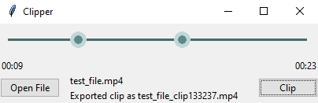

Clipper is a simple and focused app that acts on a media file to produce a 'clip' containing only the portions between a specified start and end time.
It works with multiple audio streams, and presumably (thanks to ffmpeg) any format of media file.

Clipper requires [ffmpeg](https://ffmpeg.org/) to be installed and accessible anywhere. On Windows, this means that ffmpeg.exe and ffprobe.exe must exist in a folder included in the environment variable PATH, and similarly for linux.

For those working on the source, the package [range_slider](https://github.com/lgimberis/tkinter-range-slider) must also exist under $PYTHONPATH.
